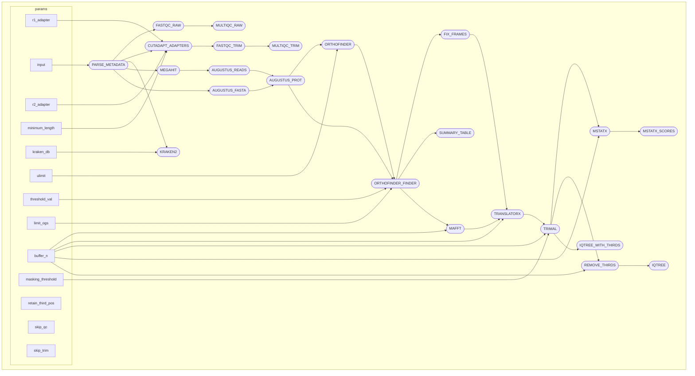

# Orthogarden :seedling:

logo

a super brief description of what it does. (~2 sentences)  
inputs  
outputs  

## contents
- [overview](#overview)
- [usage](#usage)
  - [requirements](#requirements)
  - [quick start](#quick-start)
- [accessing and interpreting output](#accessing-and-interpreting-output)
- [license](#license)

## overview

Orthogarden is a nextflow pipeline designed to leverage any combination of short reads and assemblies to generate a robust and accurate ML phylogeny with minimal user input. It attempts to accomplish this by first trimming reads, filtering reads for non-target contamination, de novo assembling reads, annotating assemblies, extracting orthologs from assemblies, and using harvested orthologs to create a phylogeny. A Nextflow-based architecture allows Orthogarden to run seamlessly from initiation to completion with little required knowledge of command line beyond installing dependencies and editing a config file to user standards. Extracting orthologs directly from de novo assemblies for direct comparison between taxa sets Orthogarden apart from other phylogenomics pipelines as it does not require a pre-selected suite of reference orthologs to function. Orthogarden is highly scalable and is demonstrated to generate accurate phylogenies from large and small datasets of varying sample quality.

Overview of pipeline:

## usage

For full documentation on using orthogarden, please see the [Orthogarden Wiki](https://github.com/jacksonhturner/orthogarden/wiki).

## requirements

## quick start

Include test dataset and a quick run of the pipeine

#TODO links to relevant wikis

## accessing and interpreting output

## license

<a href="https://github.com/jacksonhturner/orthogarden/blob/master/LICENSE">MIT license</a>
