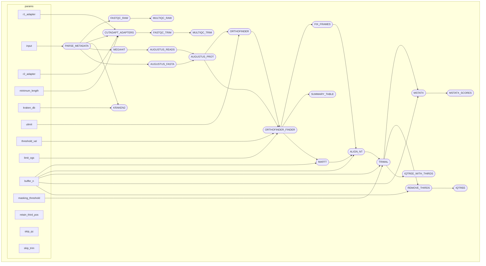

# Orthogarden :seedling:

An automated and containerized de novo assembly-based phylogenomics pipeline aimed to recover accurate and reproducible phylogenies from any combination of short reads and assemblies with particular emphasis on non-model taxa.

## Contents
- [Overview](#Overview)
- [Usage](#Usage)
  - [Requirements](#Requirements)
  - [Quick start](#Quick-start)
  -   - [Test run](#Test-run)
- [Accessing and interpreting output](#Accessing-and-interpreting-output)
- [License](#License)

## Overview

Orthogarden is a nextflow pipeline designed to leverage any combination of short reads and assemblies to generate a robust and accurate ML phylogeny with minimal user input. It attempts to accomplish this by first trimming reads, filtering reads for non-target contamination, de novo assembling reads, annotating assemblies, extracting orthologs from assemblies, and using harvested orthologs to create a phylogeny. A Nextflow-based architecture allows Orthogarden to run seamlessly from initiation to completion with little required knowledge of command line beyond installing dependencies and editing a config file to user standards. Extracting orthologs directly from de novo assemblies for direct comparison between taxa sets Orthogarden apart from other phylogenomics pipelines as it does not require a pre-selected suite of reference orthologs to function. Orthogarden is highly scalable and is demonstrated to generate accurate phylogenies from large and small datasets of varying sample quality.

Overview of pipeline:



## Requirements

nextflow (22.10.4+)

apptainer (1.1.8+)

```{bash}
git clone https://github.com/jacksonhturner/orthogarden.git
```

For more installation help, please see the [wiki](https://github.com/jacksonhturner/orthogarden/wiki/Installation-&-Dependencies).

### Usage

### Quick start

OrthoGarden requires a csv metadata file with the following headers `id`,	`r1`,	`r2`,	`ref`, and `augustus` for each input sample. The `id` and `augustus` fields must be filled out for every sample and either both `r1`/`r2` fields must be present OR the `ref` field for each sample.

Example metadata.csv:
```
id,r1,r2,ref,augustus
A_aegypti,,,/path/to/A_aegypti.fasta,aedes
A_albimanus,,,/path/to/A_albimanus.fasta,aedes
C_quinquefasciatus,C_quinquefasciatus_R1.fastq,C_quinquefasciatus_R2.fastq,,aedes
D_melanogaster,D_melanogaster_R1.fastq,D_melanogaster_R2.fastq,,fly
```
> [!NOTE]
> _The above example includes two samples using pre-assembled genomes (A_aegypti and A_albimanus) and two samples using paired-end reads (C_quinquefasciatus and D_melanogaster). Notice the Augustus references are allowed to vary._

To run the pipeline on a local linux server:
```{bash}
nextflow run /path/to/orthogarden/main.nf \
    --input metadata.csv \
    --threshold_val 0.9 \
    --publish_dir results \
    -profile local,two \
    -resume
```
> [!NOTE]
> _This is a simplified usage script, for full details on all OrthoGarden parameters see the [wiki/parameters](https://github.com/jacksonhturner/orthogarden/wiki/Parameters)._

### Test run

Once you have apptainer and nextflow installed, to make sure the pipeline is configured correctly on your machine, run the following test from within the orthogarden directory:

```{bash}
mkdir -p ~/orthogarden_test

nextflow run main.nf \
    --input tests/anopheles_pseudoref/pseudo_refs/metadata_test.csv \
    --threshold_val 0.9 \
    --publish_dir ~/orthogarden_test \
    -profile local,two \
    -resume
```

For more details on running the pipeline, installing prerequisites, or running on a slurm-based HPC, see the [wiki](https://github.com/jacksonhturner/orthogarden/wiki).

## Accessing and interpreting output

The `publish_dir` contains all of the intermediate and final files produced by OrthoGarden runs. The `work` directory contains intermediate files (see note below). Files of particular interest are noted in the example publish results below.

Sample results directory:
```
.
├── publish
|   ├── align_nt
|   ├── augustus
|   ├── design
|   ├── iqtree
|   |   ├── run_iqtree
|   |   ├── run_iqtree.best_model.nex
|   |   ├── run_iqtree.best_scheme
|   |   ├── run_iqtree.best_scheme.nex
|   |   ├── run_iqtree.bionj
|   |   ├── run_iqtree.ckp.gz
|   |   ├── run_iqtree.contree
|   |   ├── run_iqtree.iqtree
|   |   ├── run_iqtree.log
|   |   ├── run_iqtree.mldist
|   |   ├── run_iqtree.model.gz
|   |   ├── run_iqtree.splits.nex
|   |   ├── run_iqtree.treefile 🌱
|   |   └── run_iqtree.ufboot
|   ├── mafft
|   ├── mstatx
|   ├── mstatx_scores
|   ├── orthofinder
|   ├── orthofinder_finder
|   ├── remove_thirds
|   ├── summary
|   ├── summary_table
|   |   ├── summary_table_with_genes.tsv 🌱
|   |   └── summary_table_with_taxon.tsv 🌱
|   └── trimal
└── work
```

🌱 - Final treefile and relevant summary files.

> [!NOTE]
> _If you are unfamiliar with Nextflow, the `work` directory consists of hexidecimal naming structure of directories with short two character names (e.g., "6f") containing one or more nested subdirectories with longer names (e.g., "19eeb79a9315d91d177d6fe985dc8f") that hold intermediate files, links, and Nextflow commands and logs. While this convention can be hard to understand, it is recommended to keep these files untouched until you are happy with your analysis, as they are used for Nextflow's resume functionality._

## License

<a href="https://github.com/jacksonhturner/orthogarden/blob/master/LICENSE">MIT license</a>
