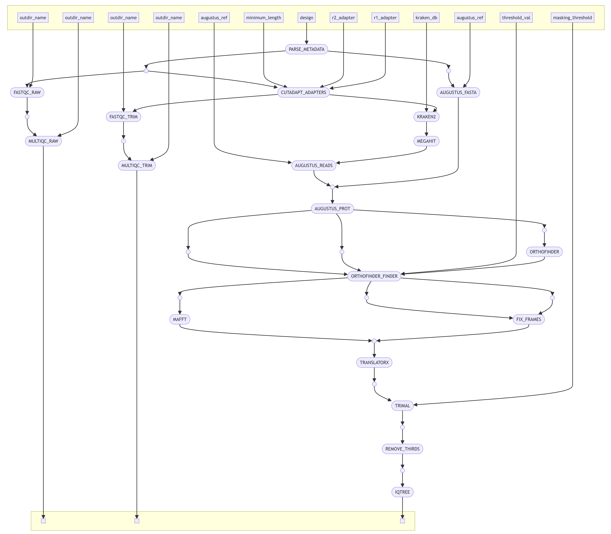

# Orthogarden

<a super brief description of what it does. (~2 sentences)>
<inputs>
<outputs>

## contents
- [overview](#overview)
- [usage](#usage)
  - [requirements](#requirements)
  - [quick start](#quick-start)
- [accessing and interpreting output](#accessing-and-interpreting-output)
- [license](#license)

## overview

Orthogarden is a nextflow pipeline designed to leverage any combination of short reads and assemblies to generate a robust and accurate ML phylogeny with minimal user input. It attempts to accomplish this by first trimming reads, filtering reads for non-target contamination, de novo assembling reads, annotating assemblies, extracting orthologs from assemblies, and using harvested orthologs to create a phylogeny. A Nextflow-based architecture allows Orthogarden to run seamlessly from initiation to completion with little required knowledge of command line beyond installing dependencies and editing a config file to user standards. Extracting orthologs directly from de novo assemblies for direct comparison between taxa sets Orthogarden apart from other phylogenomics pipelines as it does not require a pre-selected suite of reference orthologs to function. Orthogarden is highly scalable and is demonstrated to generate accurate phylogenies from large and small datasets of varying sample quality.

## usage

For full documentation on using orthogarden, please see the [Orthogarden Wiki](https://github.com/jacksonhturner/orthogarden/wiki).

## requirements

## quick start

Include test dataset and a quick run of the pipeine

<link to input format wiki>

## accessing and interpreting output

## license

<a href="https://github.com/jacksonhturner/orthogarden/blob/master/LICENSE">MIT license</a>

# current readme

# pipeline steps

## todo:
- [x] create main.nf
- [x] create nextflow.config
- [x] start a few modules
- [ ] create entry point for viral dna/individual genes from sequencing
- [x] create configs (dir) with local and slurm
- [x] determine the best container for each tool
- [ ] implement recovery step after assembly

## abstract goals:
- formatting of metadata (tip-labels)
- allow a way to add specimen?
- assume singularity for all tools
  - prioritize quay.io most of the time
  - biocontainers as well
  - dockerhub is also good

## parameters:
- metadata file (--input)
- augustus training species (--augustus_ref)
- single-copy gene frequency (--threshold_val)
- trimal masking threshold (--masking_threshold)
- profile
  - local & (four|eight|sixteen|thirty_two)
  - slurm & (campus|bigmem)

## steps:
- parse metadate (split fastq and fasta into two channels)
  - check if files are compressed (consider if this matters for entry point)
- trimming
- kraken2
- masurca
- augustus <<< entry point if no fastq
- augustus convert to codingseqs/aa (getAnnoFasta)
- [ collect all genomes here ]
- orthofinder <<< bottleneck, all samples must collect here
- orthofinder_finder (determine what cutoff to use automatically?)
  - consider a range of values
  - create a decision rule
    - desired number genes?
    - elbow approach?
- translate to protein
- align protein sequences to each other (pasta)
- map coding to amino acids
- mask
- remove thirds
- run iqtree
- change tip labels

## stretch goal:
- allow a pre-made augustus training model (fire, directory)
- create better orthologs from poor assemblies using nearest neighbors from final phylogeny
